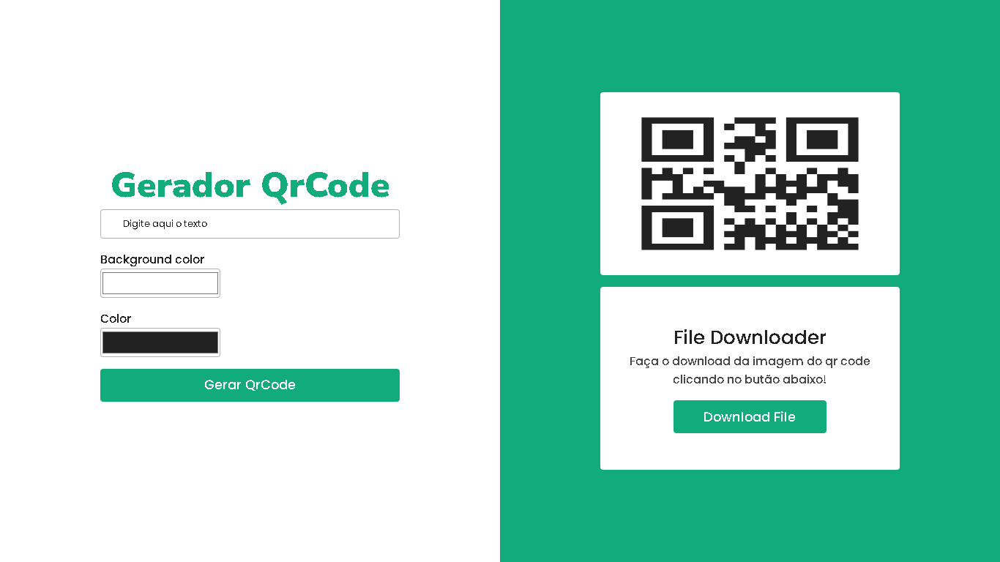

    <h1 style="font-size: 26px; font-weight: 900;">Gerador QrCode<h1>
    

        Gere os seus Qrcodes com um app rápido e intuitivo com o usuário, fique a vontade para gerar seus links ou textos usando o melhor Gerador de QrCode.
    

    <ul style="list-style:none; display: flex; gap: 1em; justify-content: center; font-size: 16px;">
        <li><a href="">Visualizar</a></li>
        <li><a>Contato</a></li>
        <li><a>Faça a sua avaliação</a></li>
    </ul>
    

        <h2 style="font-size: 20px; font-weight: 600">Tecnologias utilizadas</h2>
        ReactJs |
        Javascript |
        Css
    

    

